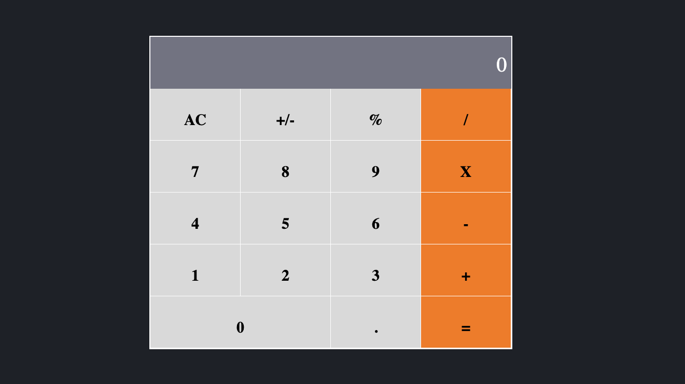

# React-calculator

> Online Calculator. [Live demo](https://calculator-mine.herokuapp.com/)

## Table of Contents

- [React-calculator](#React-calculator)
  - [Table of Contents](#table-of-contents)
  - [Background](#background)
  - [Requirements](#requirements)
  - [Install](#install)
  - [Author](#author)

## Background

# This a online Calculator built with React.js.

## Requirements

- Node.js

- React

- React-DOM

- React-Create-App

- npm

- CSS

- ES6

## Install

- Clone this repo https://github.com/AdnanAfsari/react-calculator

- `cd` to cloned repository folder `react-calculator`

- in terminal run `yarn install` or `npm install`

- Run `npm start` to stat the app in development mode

- Run `npm test` to start the test runner

## Authors

👤 **Author1**

- GitHub: [@AdnanAfsari](https://github.com/AdnanAfsari)
- Twitter: [@AdnanAfsari](https://twitter.com/adnanafsari)
- LinkedIn: [LinkedIn](https://www.linkedin.com/in/adnanafsari)

## 🤝 Contributing

Contributions, issues, and feature requests are welcome!

Feel free to check the [issues page](../../issues/).

## Show your support

Give a ⭐️ if you like this project!

## Acknowledgments

- Hat tip to anyone whose code was used
- Inspiration
- etc

## 📝 License

This project is [MIT](./MIT.md) licensed.
